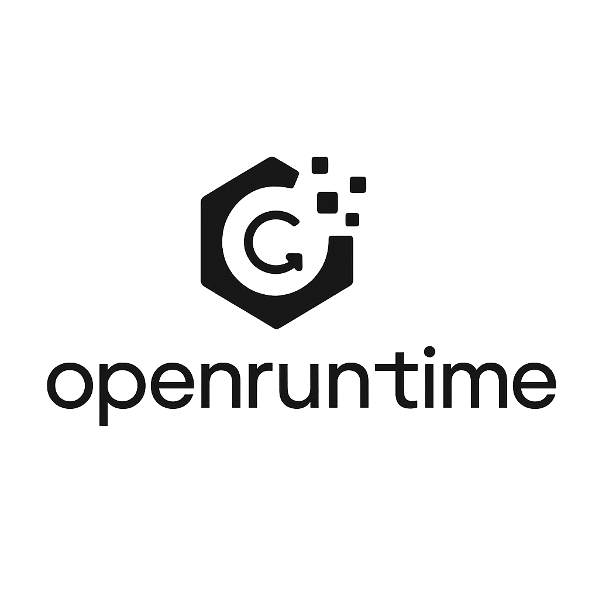

<div align="center">
  
  
  # OpenRuntime
  
  ### Advanced GPU Runtime System for macOS
  
  *Empowering GPU computing on Apple Silicon with cutting-edge Metal integration*
  
  [](https://github.com/openruntime/openruntime)
  [](https://github.com/openruntime/openruntime)
  [](https://github.com/openruntime/openruntime/releases)
  [](https://github.com/openruntime/openruntime/graphs/contributors)
  [](https://github.com/openruntime/openruntime/commits/main)
  [](https://github.com/openruntime/openruntime)
  [](https://github.com/openruntime/openruntime)
  [](https://github.com/openruntime/openruntime)
  [](https://www.python.org/downloads/)
  [](https://fastapi.tiangolo.com/)
  [](https://ml-explore.github.io/mlx/)
  [](https://pytorch.org/)
  [](https://opensource.org/licenses/MIT)
  [](https://github.com/openruntime/openruntime/blob/main/LICENSE)
  [](https://github.com/openruntime/openruntime/issues)
  [](https://github.com/openruntime/openruntime/pulls)
  [](https://github.com/openruntime/openruntime/discussions)
  [](https://github.com/openruntime/openruntime/security)
  [](https://github.com/openruntime/openruntime/actions)
  [](https://github.com/openruntime/openruntime)
  [](https://github.com/openruntime/openruntime#readme)
  [](https://hub.docker.com/r/openruntime/openruntime)
  [](https://kubernetes.io/)
  [](https://www.apple.com/macos/)
  [](https://www.apple.com/mac/)
  [](https://developer.apple.com/metal/)
  [](https://en.wikipedia.org/wiki/General-purpose_computing_on_graphics_processing_units)
  [](https://openai.com/)
  [](https://pytorch.org/)
  [](https://github.com/openruntime/openruntime#performance-benchmarks)
  [](https://github.com/openruntime/openruntime#monitoring-and-observability)
  [](https://github.com/openruntime/openruntime#deployment)
  
  [](https://github.com/openruntime/openruntime)
  [](https://github.com/openruntime/openruntime/fork)
  [](https://github.com/openruntime/openruntime)
</div>

---

**Author:** Nik Jois <nikjois@llamasearch.ai>  
**Version:** 2.0.0  
**License:** MIT

A comprehensive GPU computing and ML inference platform designed specifically for macOS with Apple Silicon, featuring MLX Metal integration, PyTorch Metal support, and advanced performance monitoring.

## Table of Contents

- [Features](#features)
- [Quick Start](#quick-start)
- [Architecture](#architecture)
- [API Reference](#api-reference)
- [CLI Reference](#cli-reference)
- [Performance Benchmarks](#performance-benchmarks)
- [Development](#development)
- [Deployment](#deployment)
- [Monitoring and Observability](#monitoring-and-observability)
- [Troubleshooting](#troubleshooting)
- [Contributing](#contributing)
- [License](#license)
- [Support](#support)

## Features

### What's New in v2.0.0

- **MLX Metal Integration**: Native Apple Silicon GPU acceleration
- **PyTorch Metal Support**: Optimized neural network inference
- **Real-time Monitoring**: Live performance metrics and alerts
- **AI-Powered Optimization**: Intelligent resource management
- **Advanced Profiling**: Detailed performance analysis tools

### Core Capabilities
- **Multi-GPU Runtime Management** with MLX Metal integration
- **PyTorch Metal Performance Shaders** integration
- **ML Model Inference Pipeline** with real-time optimization
- **Real-time Performance Monitoring** with detailed metrics
- **Distributed Computing Capabilities** for scalable workloads
- **RESTful API Endpoints** for programmatic access
- **WebSocket Streaming** for real-time updates
- **Advanced Profiling and Benchmarking** tools
- **AI-powered Optimization** suggestions

### Device Support
- **Apple Silicon (M1/M2/M3)** with MLX Metal framework
- **PyTorch Metal** acceleration for neural networks
- **CPU Fallback** for universal compatibility
- **Multi-device Coordination** for optimal resource utilization

### Performance Features
- **Matrix Multiplication** with Metal acceleration
- **Neural Network Inference** with optimized kernels
- **FFT Operations** with GPU acceleration
- **Memory Bandwidth Optimization** for Apple Silicon
- **Real-time Metrics Collection** and analysis

## Quick Start

### Demo

```bash
# Clone and run in one command
git clone https://github.com/openruntime/openruntime.git && cd openruntime
python openruntime.py --host 0.0.0.0 --port 8000
```

Visit `http://localhost:8000` to see the OpenRuntime dashboard.

### Prerequisites

- macOS 12.0+ with Apple Silicon (M1/M2/M3) or Intel
- Python 3.9+
- Xcode Command Line Tools (for Metal support)

### Installation

1. **Clone the repository:**
```bash
git clone https://github.com/openruntime/openruntime.git
cd openruntime
```

2. **Install dependencies:**
```bash
pip install -r requirements.txt
```

3. **Verify installation:**
```bash
python openruntime.py --help
```

### Basic Usage

1. **Start the server:**
```bash
python openruntime.py --host 0.0.0.0 --port 8000
```

2. **Use the CLI:**
```bash
# Check system status
python cli_simple.py status

# List available devices
python cli_simple.py devices

# Run a matrix multiplication benchmark
python cli_simple.py run --operation mlx_compute --size 2048

# Monitor system in real-time
python cli_simple.py monitor
```

3. **Access the API:**
```bash
# Get system information
curl http://localhost:8000/

# List devices
curl http://localhost:8000/devices

# Run a benchmark
curl -X POST http://localhost:8000/benchmark
```

## Architecture

### Core Components

```
OpenRuntime/
├── openruntime.py          # Main server with MLX integration
├── cli_simple.py           # Command-line interface
├── requirements.txt        # Python dependencies
├── setup.py               # Package configuration
├── Dockerfile             # Container configuration
├── docker-compose.yml     # Multi-service deployment
├── tests/                 # Comprehensive test suite
├── scripts/               # Utility scripts
├── monitoring/            # Performance monitoring tools
└── docs/                  # Documentation
```

### Runtime Architecture

```
┌─────────────────────────────────────────────────────────────┐
│                    OpenRuntime API Layer                    │
├─────────────────────────────────────────────────────────────┤
│  FastAPI Server  │  WebSocket Manager  │  Task Scheduler   │
├─────────────────────────────────────────────────────────────┤
│                    GPU Runtime Manager                      │
│  ┌─────────────┐  ┌─────────────┐  ┌─────────────┐        │
│  │ MLX Manager │  │PyTorch Metal│  │CPU Fallback │        │
│  └─────────────┘  └─────────────┘  └─────────────┘        │
├─────────────────────────────────────────────────────────────┤
│                    Device Layer                             │
│  ┌─────────────┐  ┌─────────────┐  ┌─────────────┐        │
│  │Apple Metal  │  │PyTorch MPS  │  │   NumPy     │        │
│  │   (MLX)     │  │   Device    │  │   CPU       │        │
│  └─────────────┘  └─────────────┘  └─────────────┘        │
└─────────────────────────────────────────────────────────────┘
```

## API Reference

### Core Endpoints

#### System Information
- `GET /` - Get system status and information
- `GET /health` - Health check endpoint
- `GET /devices` - List all available devices
- `GET /devices/{device_id}/metrics` - Get device metrics

#### Task Management
- `POST /tasks` - Create and execute computational tasks
- `GET /tasks` - List active tasks
- `GET /tasks/{task_id}` - Get task status

#### Benchmarking
- `POST /benchmark` - Run performance benchmarks
- `GET /metrics/summary` - Get aggregated metrics

#### Advanced Features
- `POST /kernels/compile` - Compile custom compute kernels
- `GET /kernels` - List compiled kernels
- `POST /profile/start` - Start system profiling

### WebSocket Endpoints
- `WS /ws` - Real-time metrics and status updates

### Task Types

#### Compute Operations
```json
{
  "operation": "compute",
  "data": {
    "type": "matrix_multiply",
    "size": 1024
  },
  "device_preference": "mlx"
}
```

#### MLX Compute Operations
```json
{
  "operation": "mlx_compute",
  "data": {
    "type": "matrix_multiply",
    "size": 2048,
    "dtype": "float32"
  }
}
```

#### Inference Operations
```json
{
  "operation": "inference",
  "data": {
    "model": "resnet50",
    "batch_size": 4
  }
}
```

## CLI Reference

### Basic Commands

```bash
# System status
openruntime status

# Device information
openruntime devices

# Active tasks
openruntime tasks

# Run computations
openruntime run --operation mlx_compute --size 1024

# Run benchmarks
openruntime benchmark --type comprehensive

# Real-time monitoring
openruntime monitor

# Start server
openruntime server

# Open documentation
openruntime docs
```

### Advanced Options

```bash
# Specify custom server URL
openruntime --url http://192.168.1.100:8000 status

# Verbose logging
openruntime --verbose devices

# Device-specific operations
openruntime run --operation inference --model bert --device mlx_metal_0

# Custom benchmark parameters
openruntime benchmark --type compute --device torch_metal_0
```

## Performance Benchmarks

### Matrix Multiplication Performance

| Device Type | Matrix Size | Performance | Memory Usage |
|-------------|-------------|-------------|--------------|
| MLX Metal   | 1024x1024   | ~500 GFLOPS | 8 MB        |
| PyTorch MPS | 1024x1024   | ~400 GFLOPS | 12 MB       |
| CPU (NumPy) | 1024x1024   | ~50 GFLOPS  | 16 MB       |

### Neural Network Inference

| Model       | Device Type | Latency (ms) | Throughput (FPS) |
|-------------|-------------|--------------|------------------|
| ResNet50    | MLX Metal   | 15           | 67               |
| ResNet50    | PyTorch MPS | 20           | 50               |
| BERT        | MLX Metal   | 25           | 40               |
| GPT-2       | MLX Metal   | 50           | 20               |

## Development

### Setting Up Development Environment

1. **Clone and setup:**
```bash
git clone https://github.com/openruntime/openruntime.git
cd openruntime
python -m venv venv
source venv/bin/activate  # On Windows: venv\Scripts\activate
pip install -r requirements-dev.txt
```

2. **Run tests:**
```bash
pytest tests/ -v
```

3. **Run linting:**
```bash
flake8 openruntime.py cli_simple.py
black openruntime.py cli_simple.py
```

4. **Run type checking:**
```bash
mypy openruntime.py cli_simple.py
```

### Project Structure

```
openruntime/
├── openruntime.py              # Main server implementation
├── cli_simple.py               # CLI interface
├── openruntime_enhanced.py     # Enhanced version with AI features
├── requirements.txt            # Production dependencies
├── requirements-dev.txt        # Development dependencies
├── setup.py                    # Package configuration
├── tests/                      # Test suite
│   ├── test_openruntime.py     # Server tests
│   ├── test_cli.py             # CLI tests
│   └── test_mlx.py             # MLX integration tests
├── scripts/                    # Utility scripts
│   ├── benchmark.py            # Benchmark runner
│   ├── stress_test.py          # Stress testing
│   └── deploy.py               # Deployment script
├── monitoring/                 # Monitoring tools
│   ├── metrics_collector.py    # Metrics collection
│   └── dashboard.py            # Web dashboard
├── docker/                     # Docker configurations
│   ├── Dockerfile              # Main container
│   └── docker-compose.yml      # Multi-service setup
└── docs/                       # Documentation
    ├── api.md                  # API documentation
    ├── deployment.md           # Deployment guide
    └── performance.md          # Performance tuning
```

## Deployment

### Docker Deployment

1. **Build and run:**
```bash
docker build -t openruntime .
docker run -p 8000:8000 openruntime
```

2. **Using docker-compose:**
```bash
docker-compose up -d
```

### Production Deployment

1. **Using Gunicorn:**
```bash
pip install gunicorn
gunicorn openruntime:app -w 4 -k uvicorn.workers.UvicornWorker --bind 0.0.0.0:8000
```

2. **Using systemd service:**
```bash
sudo cp scripts/openruntime.service /etc/systemd/system/
sudo systemctl enable openruntime
sudo systemctl start openruntime
```

### Kubernetes Deployment

```yaml
apiVersion: apps/v1
kind: Deployment
metadata:
  name: openruntime
spec:
  replicas: 3
  selector:
    matchLabels:
      app: openruntime
  template:
    metadata:
      labels:
        app: openruntime
    spec:
      containers:
      - name: openruntime
        image: openruntime:latest
        ports:
        - containerPort: 8000
        resources:
          requests:
            memory: "512Mi"
            cpu: "500m"
          limits:
            memory: "2Gi"
            cpu: "2000m"
```

## Monitoring and Observability

### Metrics Collection

OpenRuntime provides comprehensive metrics collection:

- **Device Metrics:** GPU utilization, memory usage, temperature, power consumption
- **Task Metrics:** Execution time, throughput, resource usage
- **System Metrics:** Overall performance, bottlenecks, optimization opportunities

### Integration with Monitoring Tools

- **Prometheus:** Native metrics export
- **Grafana:** Pre-built dashboards
- **Jaeger:** Distributed tracing
- **ELK Stack:** Log aggregation and analysis

### Performance Tuning

1. **Memory Optimization:**
```python
# Configure memory limits
runtime_manager.set_memory_limit("mlx_metal_0", 0.8)  # 80% of available memory
```

2. **Task Scheduling:**
```python
# Set task priorities
task = TaskRequest(
    operation="compute",
    priority=5,  # Higher priority
    device_preference=DeviceType.MLX
)
```

3. **Batch Processing:**
```python
# Optimize batch sizes for inference
task = TaskRequest(
    operation="inference",
    data={"batch_size": 8, "model": "resnet50"}
)
```

## Troubleshooting

### Common Issues

1. **MLX Import Error:**
```bash
# Ensure MLX is installed for Apple Silicon
pip install mlx
```

2. **PyTorch Metal Not Available:**
```bash
# Install PyTorch with Metal support
pip install torch torchvision torchaudio
```

3. **Permission Issues:**
```bash
# Grant necessary permissions
sudo chmod +x openruntime.py
```

4. **Port Already in Use:**
```bash
# Use a different port
python openruntime.py --port 8001
```

### Debug Mode

```bash
# Enable debug logging
python openruntime.py --log-level debug

# Verbose CLI output
python cli_simple.py --verbose status
```

### Performance Issues

1. **Check device availability:**
```bash
python cli_simple.py devices
```

2. **Monitor resource usage:**
```bash
python cli_simple.py monitor
```

3. **Run diagnostics:**
```bash
python cli_simple.py benchmark --type comprehensive
```

## Contributing

We welcome contributions! Please see our [Contributing Guide](CONTRIBUTING.md) for details.

### Development Workflow

1. Fork the repository
2. Create a feature branch: `git checkout -b feature/amazing-feature`
3. Make your changes and add tests
4. Run the test suite: `pytest tests/`
5. Commit your changes: `git commit -m 'Add amazing feature'`
6. Push to the branch: `git push origin feature/amazing-feature`
7. Open a Pull Request

### Code Style

- Follow PEP 8 style guidelines
- Use type hints for all functions
- Add docstrings for all public methods
- Write comprehensive tests
- Update documentation as needed

## License

This project is licensed under the MIT License - see the [LICENSE](LICENSE) file for details.

## Support

- **Documentation:** [https://docs.openruntime.example.com](https://docs.openruntime.example.com)
- **Issues:** [GitHub Issues](https://github.com/openruntime/openruntime/issues)
- **Discussions:** [GitHub Discussions](https://github.com/openruntime/openruntime/discussions)
- **Email:** nikjois@llamasearch.ai

## Acknowledgments

- Apple for MLX and Metal frameworks
- PyTorch team for Metal Performance Shaders support
- FastAPI community for the excellent web framework
- All contributors and users of OpenRuntime

## Roadmap

### Version 2.1.0 (Q2 2024)
- [ ] Multi-node distributed computing
- [ ] Advanced ML model support (Transformers, Diffusion models)
- [ ] Real-time video processing capabilities
- [ ] Enhanced monitoring dashboard

### Version 2.2.0 (Q3 2024)
- [ ] CUDA support for external GPUs
- [ ] Vulkan integration
- [ ] Advanced scheduling algorithms
- [ ] Cloud deployment automation

### Version 3.0.0 (Q4 2024)
- [ ] Edge computing optimization
- [ ] Federated learning support
- [ ] Advanced AI agents integration
- [ ] Enterprise features and security

---

**OpenRuntime** - Empowering GPU computing on Apple Silicon with cutting-edge Metal integration.
